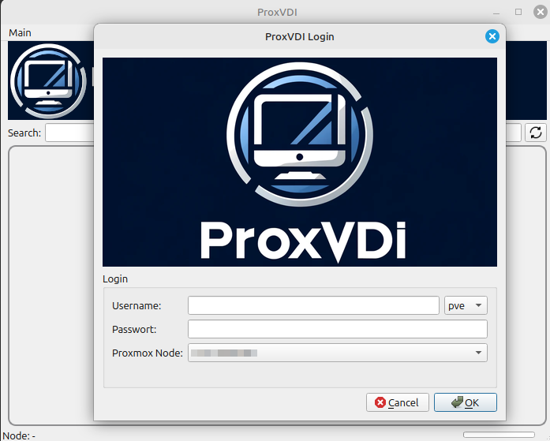
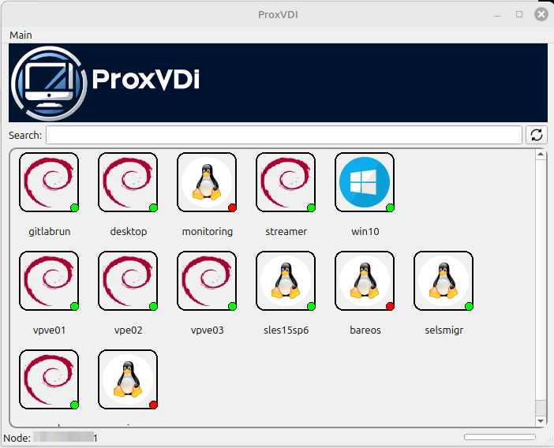
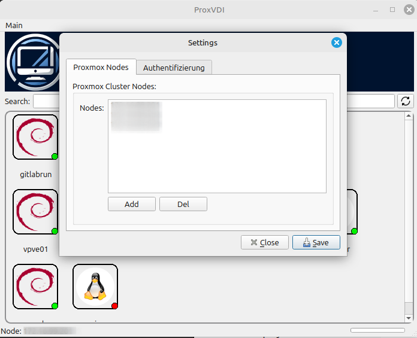
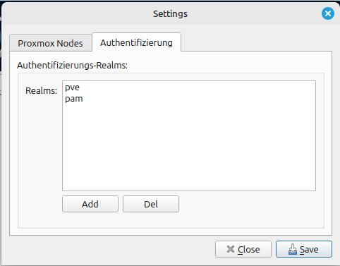

# ProxVDI Client

Ein einfacher VDI-Client für Proxmox, entwickelt für Anwender, um bequem auf virtuelle Maschinen (VMs) zuzugreifen.







## Funktionen

- **Benutzerfreundliche Oberfläche**: Intuitive GUI für den schnellen Zugriff auf Ihre VMs.
- **VM-Anzeige mit Icons**: Passende Betriebssystem-Icons für eine übersichtliche Darstellung.
- **Verbindungsmöglichkeiten**:
  - **Spice**: Starten Sie VMs mit Spice-Unterstützung direkt mit dem Spice-Client.
  - **VNC** und **SSH**: Alternative Verbindungsoptionen für den Zugriff auf Ihre VMs.
- **VM-Steuerung**: Starten und Stoppen von VMs innerhalb des Clients.
- **Statusanzeige**:
  - **Grüner Punkt**: VM ist gestartet und verfügbar.
  - **Roter Punkt**: VM ist gestoppt und nicht verfügbar

## Voraussetzungen

- **Python 3**
- **PyQt5**
- **Proxmox VE** Umgebung
- **Spice-Client** Der VDI Client benötigt den Remote Client virt-viewer, dieser ist bei vielen Linux Distributionen im Repository vorhanden.

## Installation

1. **Repository klonen**:

   ```bash
   git clone https://github.com/IhrBenutzername/proxmox-vdi-client.git

   
2. **Abhängigkeiten installieren**:

   ```bash
   pip install -r requirements.txt
   ```
3. **Anwendung starten**:

   ```bash
   python main.py
   ```
   
## Erste Schritte

1. **Einstellungen konfigurieren**:
    * Öffne das Hauptmenü "main", dann "Settings"
    * Füge im Reiter "Proxmox Nodes" deine Proxmox Cluster Nodes hinzu
    * Im Reiter "Authentifizierung" kannst du deine REALMs eintragen.

2. **Anmelden**:
    * Gib deinen Proxmox Username und das Passwort dazu ein.
    * Wähle den passenden REALM aus
    * Wähle einen deiner Nodes aus
    * Starte das Login mit klick auf "OK"
   
3. **Auf VMs zugreifen:
    * Nach erfolgreicher Anmeldung werden nach kurzer Zeit alle VMs auf die du Zugriff hast angezeigt.
    * Die VMs werden mit dem Logo des OS angezeigt.
    * Im Icon ist ein Punkt zusehen, dieser zeigt ob die VM läuft
    * Durch Doppelklick kannst du nun die Verbindung zu deiner VM starten
    * Das System wählt automatisch den Verbindungstype SPICE, VNC oder SSH
   
## Hinweis

Der Client befindet sich noch in einem frühen Entwicklungsstadium und ist nicht für den produktiven Einsatz empfohlen.

## Lizenz

Dieses Projekt steht unter der [MIT-Lizenz](LICENSE.txt).